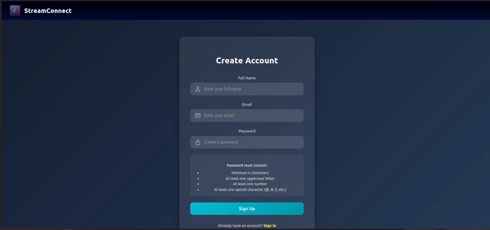

# Movie Recommendation System

## Overview

This repository contains a **Movie Recommendation System** built with a modular architecture that integrates backend, frontend, and machine learning components. The application provides personalized movie recommendations to users based on their preferences and interactions.

## Table of Contents

1. [Features](#features)
2. [Architecture](#architecture)
3. [Tech Stack](#tech-stack)
4. [Backend](#backend)
5. [Frontend](#frontend)
6. [ML API](#ml-api)
7. [Setup Instructions](#setup-instructions)
8. [Usage](#usage)
9. [Project Structure](#project-structure)
10. [Screenshots](#screenshots)
11. [License](#license)

---

## Features

- **User Authentication:** Secure login and registration using JWT.
- **Movie Database:** Integration with movie datasets for a rich user experience.
- **Personalized Recommendations:** Machine learning-based recommendations using collaborative filtering and clustering.
- **Interactive UI:** Clean and responsive frontend for seamless user interaction.
- **Scalable Architecture:** Designed with modularity in mind, making it easy to extend and maintain.

---

## Architecture


### Components:

1. **Backend (NestJS):** Handles authentication, database operations, and API endpoints.
2. **Frontend (React with Vite):** Provides the user interface.
3. **ML API (FastAPI):** Powers the recommendation system and clustering models.

---

## Tech Stack

### Backend

- **Framework:** [NestJS](https://nestjs.com/)
- **Database:** PostgreSQL
- **Authentication:** JWT (JSON Web Tokens)

### Frontend

- **Framework:** [React](https://reactjs.org/) with [Vite](https://vitejs.dev/)
- **Styling:** CSS Modules

### ML API

- **Framework:** [FastAPI](https://fastapi.tiangolo.com/)
- **Libraries:** scikit-learn, TensorFlow, pandas, numpy

---

## Backend

The backend is implemented using **NestJS** and follows a modular structure. It connects to a PostgreSQL database and provides APIs for user management, movie data, and ratings.

### Key Features

- Modular structure with separate controllers, services, and entities for each module (e.g., `auth`, `movie`, `rating`).
- Database integration using TypeORM.
- Preloaded movie data using CSV files.

#### Scripts

- Populate the database:
  ```bash
  npm run populate:db-movie
  npm run populate:db-user
  npm run populate:db-rating
  ```
- Start the backend:
  ```bash
  npm run start:dev
  ```

---

## Frontend

The frontend is built with **React** and uses **Vite** for fast development. It provides an interactive UI for users to browse movies, view recommendations, and manage their profiles.

### Key Features

- Responsive design for all screen sizes.
- Components organized by feature (e.g., `pages/catalog`, `pages/signup`).
- API integration with the backend for real-time updates.

#### Start the Frontend

```bash
npm install
npm run dev
```

---

## ML API

The machine learning API, implemented in **FastAPI**, powers the recommendation system and clustering functionalities.

### Key Features

- **Recommendation Models:**
  - Collaborative Filtering using TensorFlow.
  - Content-based filtering with TF-IDF.
- **Clustering:**
  - KMeans for grouping similar users/movies.

### Endpoints

- `/predict`: Returns movie recommendations for a given user.
- `/clustering`: Provides insights into user clusters.

#### Start the ML API

```bash
uvicorn app.main:app --reload
```

---

## Setup Instructions

### Prerequisites

- Node.js (v16+)
- Python (3.8+)
- PostgreSQL

### Steps

1. **Clone the Repository:**
   ```bash
   git clone https://github.com/your-repo.git
   cd your-repo
   ```
2. **Install Dependencies:**
   - Backend:
     ```bash
     cd backend
     npm install
     ```
   - Frontend:
     ```bash
     cd ../frontend
     npm install
     ```
   - ML API:
     ```bash
     cd ../ml-api
     pip install -r requirements.txt
     ```
3. **Configure the Environment Variables:**
   - Backend: Create a `.env` file in the `backend` folder.
   - ML API: Create a `.env` file in the `ml-api` folder.
4. **Run All Services:**
   - Backend:
     ```bash
     npm run start:dev
     ```
   - Frontend:
     ```bash
     npm run dev
     ```
   - ML API:
     ```bash
     uvicorn app.main:app --reload
     ```

---

## Usage

- Access the frontend at: `http://localhost:5173`
- Backend API runs at: `http://localhost:3000`
- ML API runs at: `http://localhost:8111`

---

## Project Structure

### Backend

```
backend/
  src/
    auth/
    movie/
    rating/
    user/
    ...
  dist/
  node_modules/
  package.json
```

### Frontend

```
frontend/
  src/
    pages/
    components/
    hooks/
    ...
  dist/
  node_modules/
  package.json
```

### ML API

```
ml-api/
  app/
    models/
    routes/
    services/
    ...
  model/
    saved_models/
    data/
  requirements.txt
```

---

## Screenshots

### Home Page


### Sign In Page


### Sign Up Page


### Dashboard Catalog


### Dashboard Recommendations


### Movie Page 1


### Movie Page 2


### Movie Page 3


---

## License

This project is licensed under the [MIT License](LICENSE.md).

